# Assignment 5 — Bash Script Automation Drill (OPS Checklist)

Part of the DevOps Micro Internship (DMI) Cohort 3 with Agentic AI

---

## Purpose

In this assignment, you will practice Bash scripting by building a series of small automation scripts covering environment setup, variables, arrays, loops, file conditionals, if-else logic, and functions. These scripts form the foundation of real-world Linux automation used in DevOps, cloud, and production support environments.

---

# Task 1 — Bash Environment & Workspace Setup

## Goal

Verify that Bash is available on your system and create a clean workspace for this assignment.

### Evidence

#### Screenshot 1 — Output of `echo $SHELL` and `bash --version`

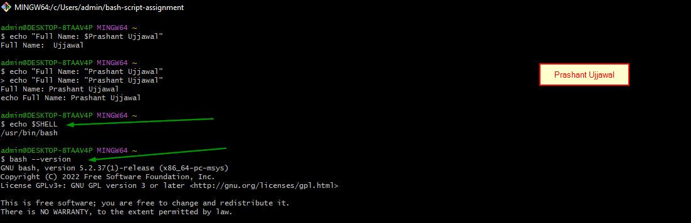

---

#### Screenshot 2 — Output of `pwd` and `ls -lah` showing the scripts directory

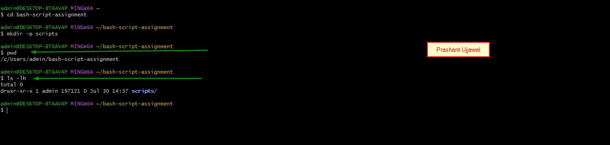

---

### Notes

Answer the following in your own words:

**1. What is Bash?**

Bash is a command-line interpreter used to run Linux commands and automate repetitive tasks through scripts.

---

**2. What is the difference between shell and Bash?**

A shell is any program used to interact with the operating system, while Bash is one specific and widely used type of shell.

---

**3. Why is it important to confirm the Bash version before writing scripts?**

Checking the Bash version ensures the script features you use are supported and helps prevent compatibility errors.

---

# Task 2 — Your First Bash Script

## Goal

Create your first Bash script, make it executable, and run it from the terminal.

### Evidence

#### Screenshot 1 — Content of `first-script.sh`

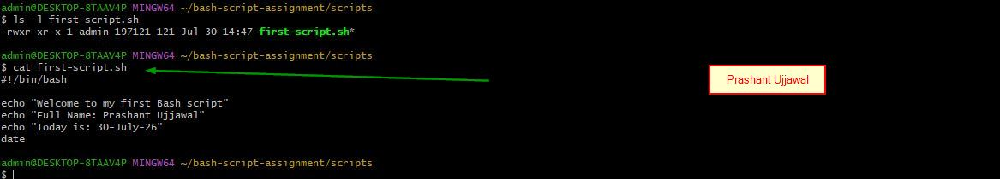

---

#### Screenshot 2 — Output of `./first-script.sh`

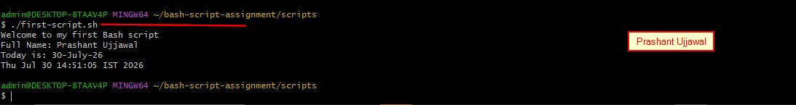

---

#### Screenshot 3 — Output of `ls -l first-script.sh` showing executable permission

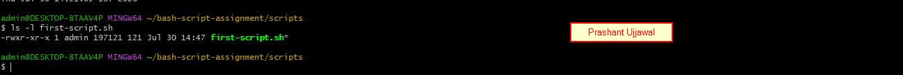

---

### Notes

Answer the following in your own words:

**1. What is the purpose of `#!/bin/bash`?**

It tells the system to execute the script using the Bash interpreter.

---

**2. Why do we use `chmod +x` before running a script?**

chmod +x gives the file execute permission so it can be run directly as ./script.sh.

---

**3. What is the difference between running a script using `./script.sh` and `bash script.sh`?**

./script.sh requires execute permission, while bash script.sh runs through Bash even without execute permission.

---

# Task 3 — Variables: User Information Script

## Goal

Use variables to store and display user-related information.

### Evidence

#### Screenshot 1 — Content of `user-info.sh`

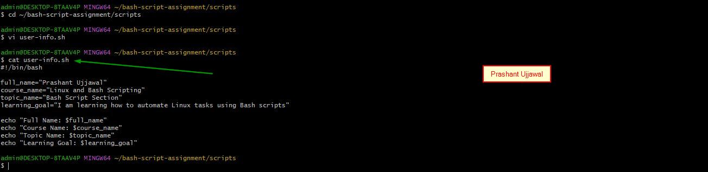

---

#### Screenshot 2 — Output of `./user-info.sh`

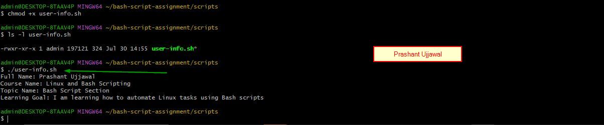

---

### Notes

Answer the following in your own words:

**1. What is a variable in Bash?**

A Bash variable stores information such as text or numbers that can be reused later in the script.

---

**2. Why should we avoid spaces around the `=` sign when creating variables?**

Bash treats spaces around = as separate command elements, causing the variable assignment to fail.

---

**3. How do you access the value stored inside a Bash variable?**

Use the $ symbol before the variable name, such as $name or ${name}.

---

# Task 4 — Arrays & Loops: Tools Checklist Script

## Goal

Use arrays and loops to print a checklist of tools used in Bash scripting.

### Evidence

#### Screenshot 1 — Content of `tools-checklist.sh`

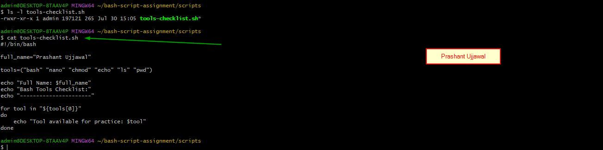

---

#### Screenshot 2 — Output of `./tools-checklist.sh`

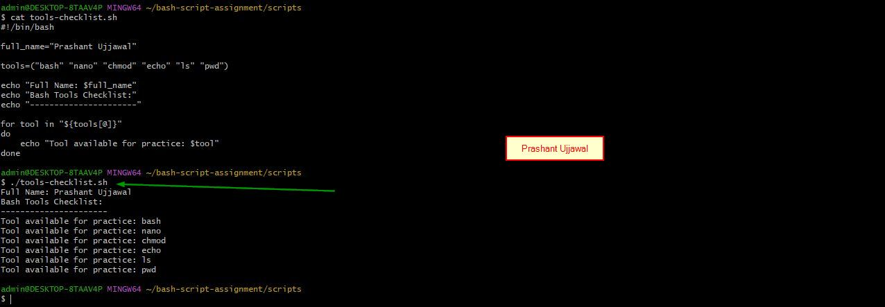

---

### Notes

Answer the following in your own words:

**1. What is an array in Bash?**

An array is a variable that stores multiple related values under one name.

---

**2. Why are arrays useful in scripts?**

Arrays make it easier to organize, process and update multiple values without creating many separate variables.

---

**3. What does `"${tools[@]}"` mean?**

It represents all elements stored in the tools array, preserving each item as a separate value.

---

**4. What is the purpose of the `for` loop in this script?**

The for loop processes each item in the array and performs the same action for every tool.

---

# Task 5 — Loops: Number Counter Script

## Goal

Use loops to repeat a task multiple times.

### Evidence

#### Screenshot 1 — Content of `counter.sh`

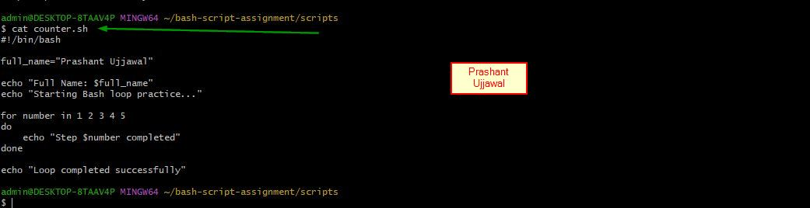

---

#### Screenshot 2 — Output of `./counter.sh`

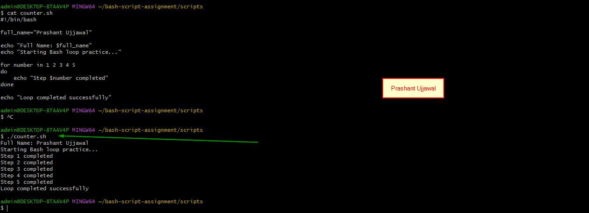

---

### Notes

Answer the following in your own words:

**1. What is a loop?**

A loop is a programming structure that repeatedly executes a set of commands.

---

**2. Why do we use loops in Bash scripting?**

Loops automate repetitive work, reduce duplicate code and make scripts shorter and easier to maintain.

---

**3. How many times did the loop run in your script?**

The loop ran five times and printed the numbers from 1 to 5.

---

**4. What would you change if you wanted the loop to run 10 times?**

I would change the number range to for number in {1..10} so the loop runs ten times.

---

# Task 6 — Files & Conditionals: File Validation Script

## Goal

Use file checks and conditionals to verify whether files and directories exist.

### Evidence

#### Screenshot 1 — Output of `ls -lah ../test-folder`

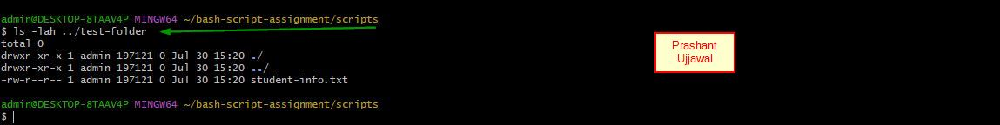

---

#### Screenshot 2 — Content of `file-check.sh`

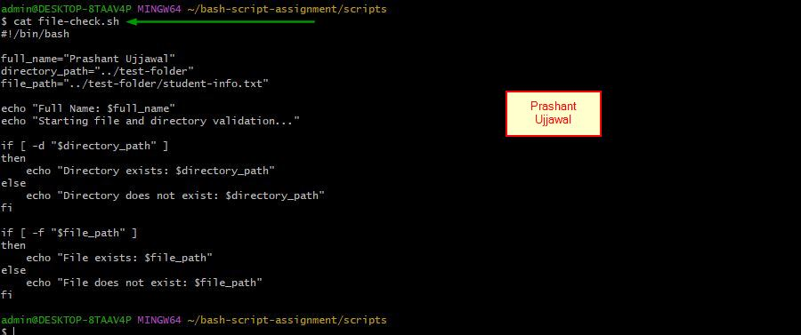

---

#### Screenshot 3 — Output of `./file-check.sh`

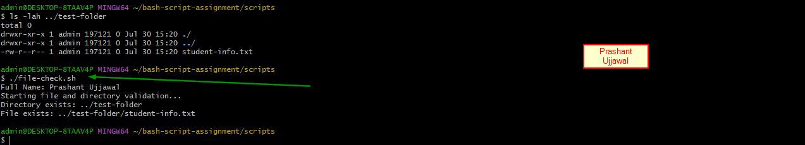

---

### Notes

Answer the following in your own words:

**1. What does `-d` check in Bash?**

-d checks whether the specified path exists and is a directory.

---

**2. What does `-f` check in Bash?**

-f checks whether the specified path exists and is a regular file.

---

**3. Why should file and directory paths be stored in variables?**

Variables make paths easier to reuse and allow future changes to be made in only one place.

---

**4. What happens if the file does not exist?**

The condition becomes false, so the script runs the else block and displays a file-not-found message.

---

# Task 7 — Conditionals: Pass or Retry Script

## Goal

Use if-else conditionals to make decisions based on a variable value.

### Evidence

#### Screenshot 1 — Content of `score-check.sh` with `score=85`

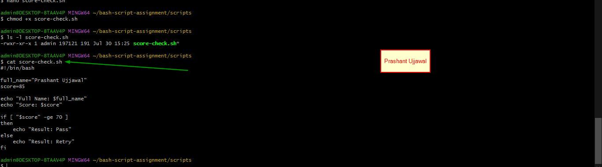

---

#### Screenshot 2 — Output showing `Result: Pass`

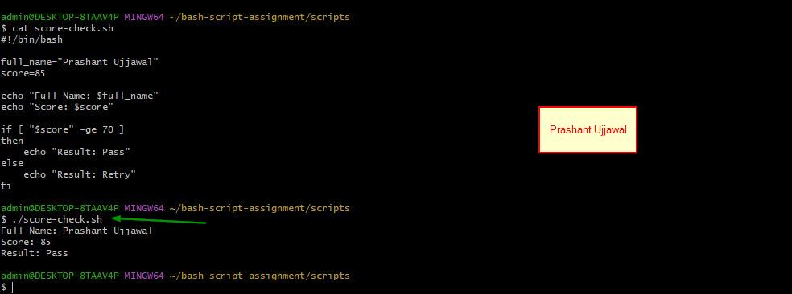

---

#### Screenshot 3 — Content of `score-check.sh` with `score=55`

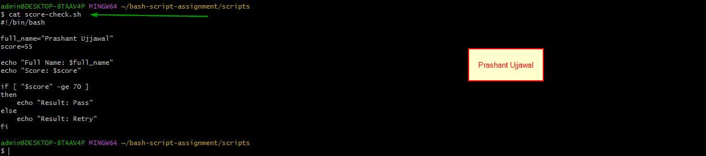
---

#### Screenshot 4 — Output showing `Result: Retry`

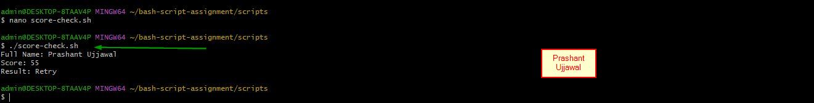

---

### Notes

Answer the following in your own words:

**1. What is the purpose of if-else in Bash?**

An if-else statement lets the script choose different actions depending on whether a condition is true or false.

---

**2. What does `-ge` mean?**

-ge means greater than or equal to and is used for comparing numeric values.

---

**3. Why should conditions be tested with different values?**

Testing different values confirms that both the true and false paths work correctly.
---

**4. How can conditionals help in automation scripts?**

Conditionals allow scripts to make decisions automatically based on system status, input or command results.

---

# Task 8 — Functions: Final Bash Automation Script

## Goal

Create a final Bash script using functions to organize reusable code.

### Evidence

#### Screenshot 1 — Content of `final-automation.sh`

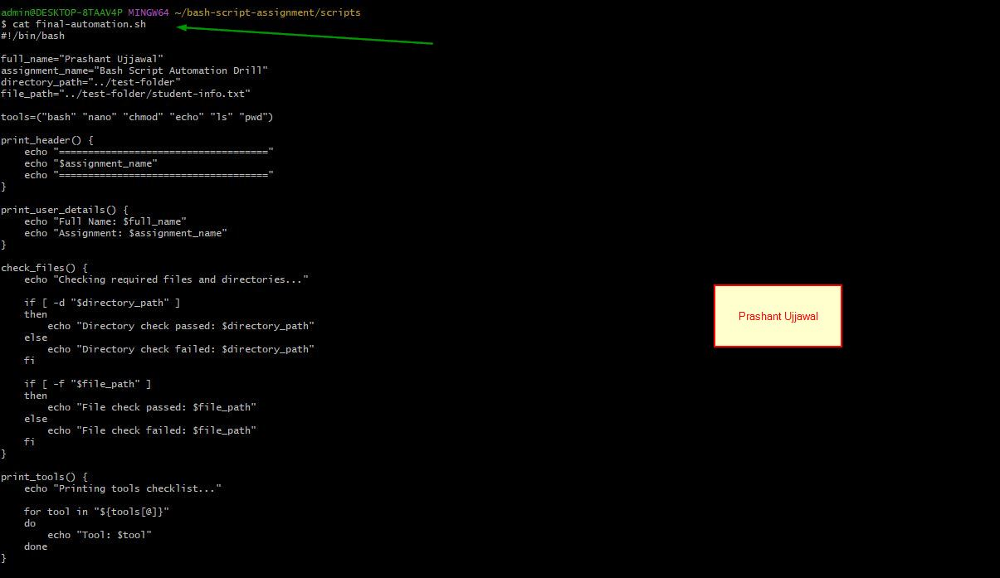

---

#### Screenshot 2 — Output of `./final-automation.sh`

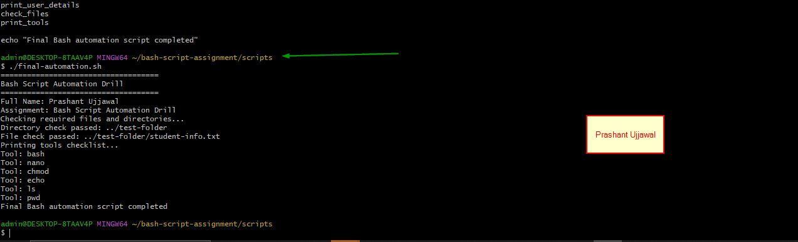

---

#### Screenshot 3 — Output of `ls -lah` showing all created scripts

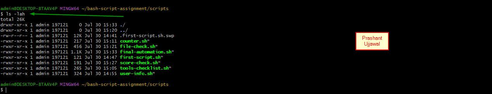

---

### Notes

Answer the following in your own words:

**1. What is a function in Bash?**

A function is a reusable block of commands designed to perform one specific task.

---

**2. Why are functions useful in scripts?**

Functions reduce repeated code and make scripts more organized, readable and easier to maintain.

---

**3. Which functions did you create in this script?**

I created print_header(), print_user_details(), check_files() and print_tools().

---

**4. How does this final script combine variables, arrays, loops, conditionals, files, and functions?**

It uses variables to store data, arrays and loops to process tools, conditionals to check files, and functions to organize each task.

---

# LinkedIn Post (Required)

## Evidence

#### LinkedIn Post URL

Paste your LinkedIn post URL here:

`Add your URL here`

---

#### Screenshot — Published LinkedIn post

Add your screenshot here.

---

# Submission Instructions

- Add all required screenshots in your submission
- Full name must be visible in required screenshots
- All script files must be created and run successfully
- Required notes must be answered clearly for every task
- Do not expose sensitive information (keys, passwords, credentials)

---

# Completion Checklist

- [x] Task 1: Environment setup verified, workspace created (Screenshots 1–2, Notes answered)
- [x] Task 2: First script created, executed, permissions verified (Screenshots 1–3, Notes answered)
- [x] Task 3: Variables script created and run (Screenshots 1–2, Notes answered)
- [x] Task 4: Arrays and loops script created and run (Screenshots 1–2, Notes answered)
- [x] Task 5: Counter loop script created and run (Screenshots 1–2, Notes answered)
- [x] Task 6: File validation script created and run (Screenshots 1–3, Notes answered)
- [x] Task 7: Pass/Retry conditional script tested with both values (Screenshots 1–4, Notes answered)
- [x] Task 8: Final automation script created and run (Screenshots 1–3, Notes answered)
- [x] All scripts run without errors
- [x] Full Name visible in all required screenshots
- [ ] LinkedIn post published and URL submitted
- [x] No sensitive data exposed

---

## 📌 About DMI & CloudAdvisory

DevOps Micro Internship (DMI) is a project-based DevOps program run by Pravin Mishra (The CloudAdvisory) focused on real-world execution, systems thinking, and career readiness.

It helps learners build strong DevOps foundations with hands-on experience.

---

## 📌 Resources

- 🌐 DMI Official Website: https://dmi.pravinmishra.com?utm_source=github&utm_medium=readme  
- 🎓 University: https://university.pravinmishra.com?utm_source=github&utm_medium=readme  
- 💬 Discord Community: https://discord.pravinmishra.com?utm_source=github&utm_medium=readme  
- 📝 Blog: https://dmi.pravinmishra.com/blog?utm_source=github&utm_medium=readme  
- ▶️ YouTube Playlist: https://www.youtube.com/playlist?list=PLFeSNDtI4Cho  
- 🔗 Pravin Mishra (LinkedIn): https://www.linkedin.com/in/pravin-mishra-aws-trainer/  
- 🏢 CloudAdvisory (LinkedIn): https://www.linkedin.com/company/thecloudadvisory/

---

*This submission is part of DevOps Micro Internship (DMI) Cohort 3 — Agentic AI Track.*