# Assignment 6 — Build an AI-Assisted Linux Health Check (AI-Assisted Linux Incident Triage)

Part of the DevOps Micro Internship (DMI) Cohort 3 with Agentic AI

---

## Purpose

In this assignment, you will build a read-only Bash triage script that checks the health of your Ubuntu server and Nginx application, connect it to Claude Code as a reusable `/linux-triage` skill, simulate a controlled Nginx incident, use the skill to gather and analyze evidence, recover the service manually, and verify recovery. The workflow follows the Agentic Loop: Gather → Analyze → Human Act → Verify.

---

# Task 1 — Confirm the Healthy Baseline and Create the Workspace

## Goal

Confirm that Nginx and the React application are healthy before building the automation.

### Evidence

#### Screenshot 1 — Output of `systemctl is-active nginx`, `ss -ltn | grep ':80'`, and `curl -I http://localhost`

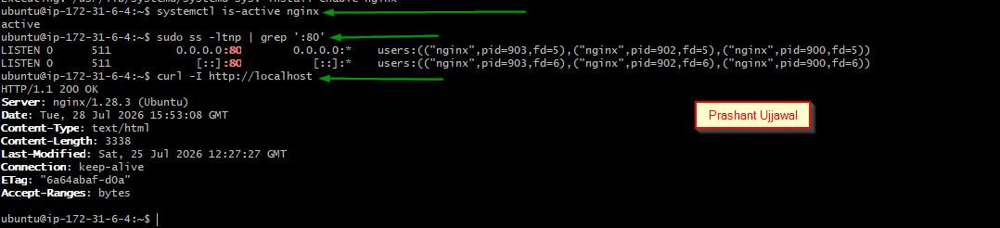

---

#### Screenshot 2 — Output of `pwd` and `find . -maxdepth 4 -type d | sort` showing the workspace folder structure

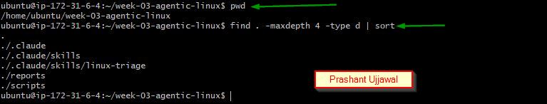

---

### Notes

Answer the following in your own words:

**1. What proves that Nginx is running?**

The systemctl is-active nginx command returned active, confirming that the Nginx service is running.

---

**2. What proves that the server is listening for HTTP traffic?**

The ss -ltn | grep ':80' command showed port 80 in the listening state, proving the server can accept HTTP traffic.

---

**3. Why must you capture a healthy baseline before simulating an incident?**

A healthy baseline provides a normal reference that helps identify what changed during the incident and verify recovery later.

---

# Task 2 — Create Project Context and Safety Rules in CLAUDE.md

## Goal

Tell Claude exactly what this project does and what it is not allowed to do.

### Evidence

#### Screenshot 3 — CLAUDE.md open in VS Code showing all four sections (Project Overview, Incident Workflow, Safety Rules, Output Rules)

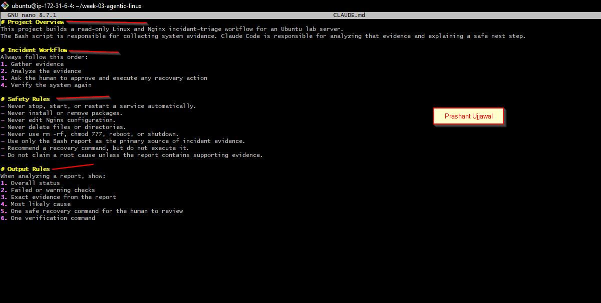

---

### Notes

Answer the following in your own words:

**1. Why should Claude receive project-specific operational rules?**

Project-specific rules guide Claude to follow the correct workflow and prevent unsafe or unauthorized actions.

---

**2. Why is the human required to execute the recovery command?**

A human must review the evidence and approve the recovery action before making changes to the server.

---

**3. Which rule prevents Claude from making an unsupported diagnosis?**

The rule “Do not claim a root cause unless the report contains supporting evidence” prevents unsupported diagnosis.

---

# Task 3 — Use Agentic AI to Plan Before Writing the Script

## Goal

Use Claude Code to inspect the environment and produce a read-only plan before creating any Bash code.

### Evidence

#### Screenshot 4 — Claude Code showing the five-check plan and read-only inspection results

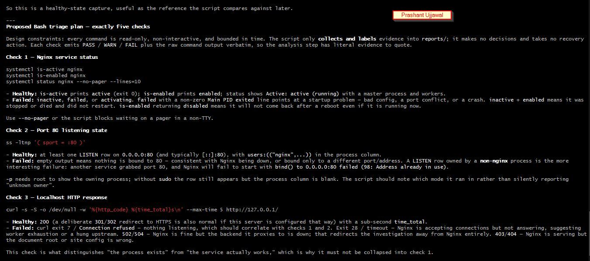
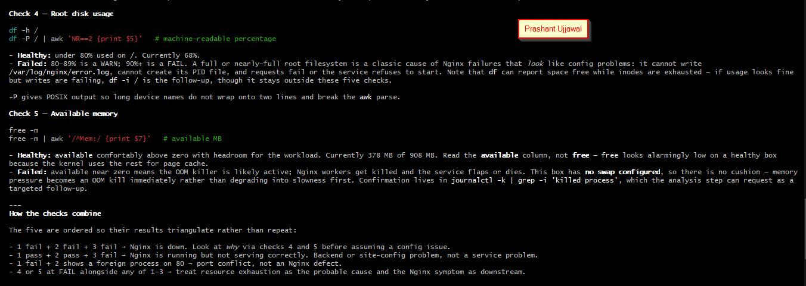
---

### Notes

Answer the following in your own words:

**1. Which part of this task represents the Gather phase?**

The read-only commands used to inspect the server and collect health information represent the Gather phase.

---

**2. Did Claude follow the instruction not to create files? How did you verify this?**

Yes, Claude used only read-only commands, and I verified that no new files or modifications appeared in the workspace.

---

**3. Why is planning before coding useful in DevOps automation?**

Planning identifies the required checks and safety boundaries first, making the automation more accurate and organized.

---

# Task 4 — Build the Linux Triage Bash Script

## Goal

Create one Bash script that gathers consistent Linux and Nginx health evidence.

### Evidence

#### Screenshot 5 — Top section of `linux-triage.sh` showing variables, thresholds, and the checks array

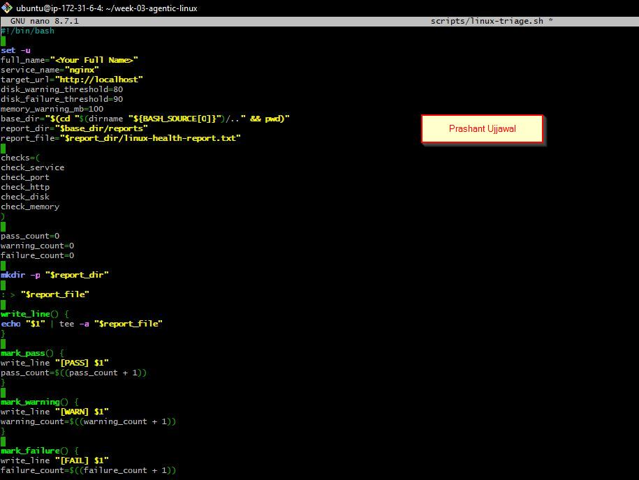

---

#### Screenshot 6 — Middle section showing check functions and conditionals

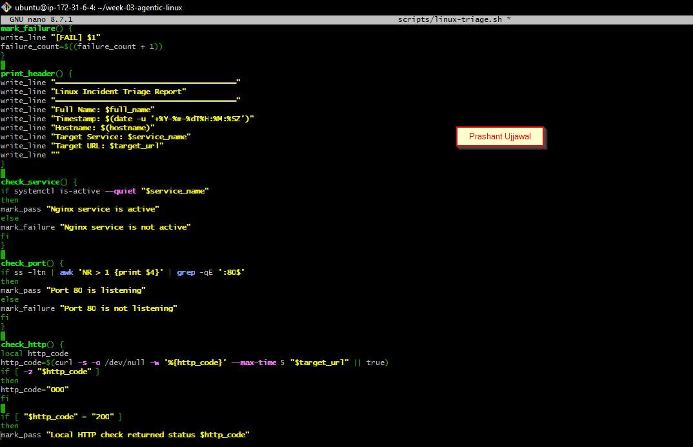
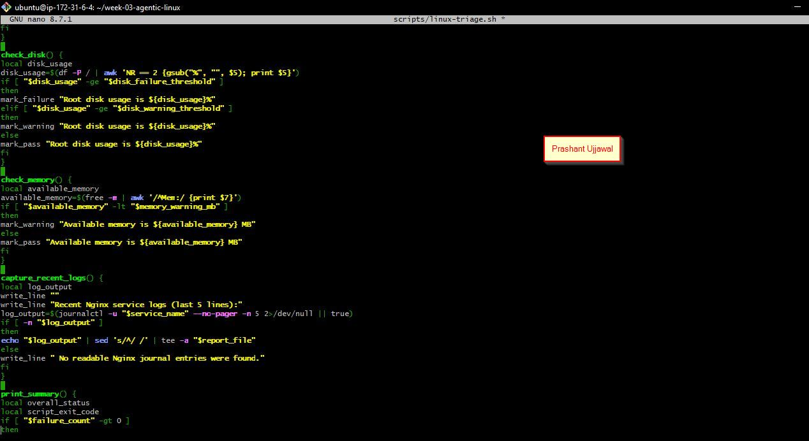

---

#### Screenshot 7 — Bottom section showing the loop, summary function, and exit behavior

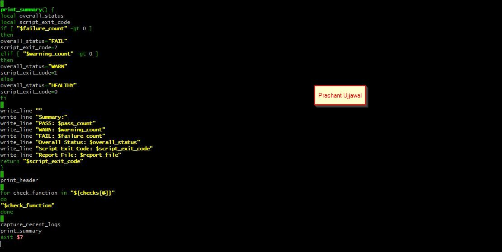

---

#### Screenshot 8 — Output of `bash -n scripts/linux-triage.sh` (no syntax errors) and `ls -l scripts/linux-triage.sh` showing executable permission

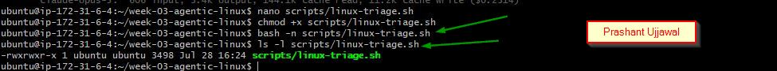

---

### Notes

Answer the following in your own words:

**1. What is stored in the checks array?**

The checks array stores the names of the service, port, HTTP, disk and memory health-check functions.

---

**2. How does the `for` loop use that array?**

The for loop reads each function name from the array and executes every health check one by one.

---

**3. Why are the health checks separated into functions?**

Functions keep the script modular, readable and easier to test, maintain or update.

---

**4. What is the purpose of `$(...)` in this script?**

$(...) executes a command and captures its output so it can be stored in a variable or used elsewhere.

---

**5. Why does the script use different exit codes for HEALTHY, WARN, and FAIL?**

Different exit codes allow tools and users to quickly identify whether the result is healthy, contains a warning or has a critical failure.

---

# Task 5 — Run and Understand the Healthy-State Report

## Goal

Run the Bash script against the healthy server and verify that it creates a report.

### Evidence

#### Screenshot 9 — Output of `./scripts/linux-triage.sh` showing your Full Name and all five check results

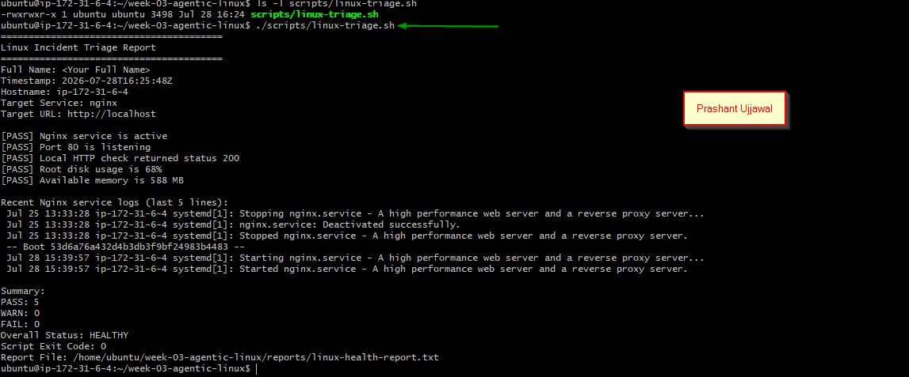

---

#### Screenshot 10 — Output showing the captured exit code and final summary

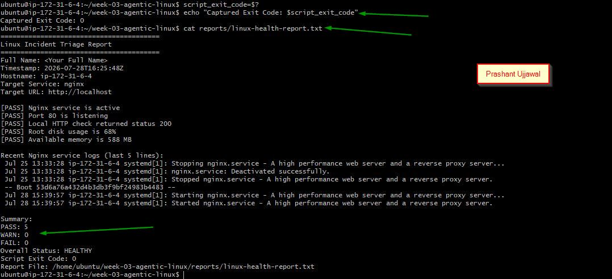

---

### Notes

Answer the following in your own words:

**1. What is the overall status of your healthy baseline?**

The overall status was HEALTHY because all required checks completed without any failures.

---

**2. Which exact Linux evidence proves the application is serving traffic?**

The curl -I http://localhost command returned HTTP/1.1 200 OK, proving that the application was serving traffic.

---

**3. Did your script return exit code 0 or 1? Explain why.**

My script returned exit code 0 because all checks passed and no warning or failure was reported.

---

**4. What is the difference between a warning and a failure in this script?**

A warning means the system is still working but needs attention, while a failure means a critical check did not pass.

---

# Task 6 — Create and Run the /linux-triage Skill

## Goal

Turn the Bash script into a reusable, manually invoked Agentic AI workflow.

### Evidence

#### Screenshot 11 — `SKILL.md` showing the frontmatter, allowed tool restrictions, and safety rules

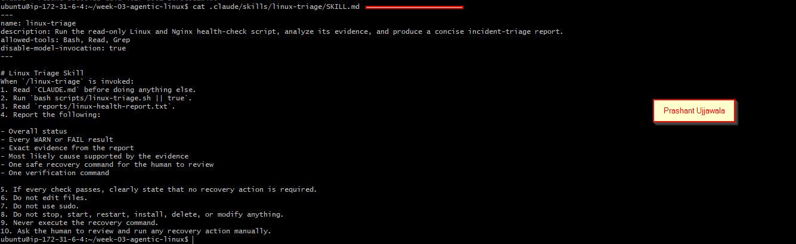

---

#### Screenshot 12 — `/linux-triage` output for the healthy server

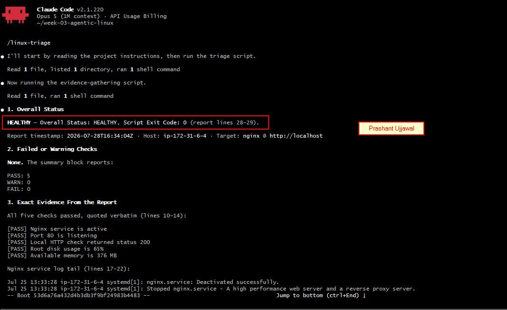

---

### Notes

Answer the following in your own words:

**1. Why does this skill have Bash, Read, and Grep, but not Write?**

The skill needs Bash, Read and Grep to collect and analyze evidence, but it does not need Write because it must not modify files or the server.

---

**2. Why is `disable-model-invocation: true` useful for this skill?**

It ensures the skill runs only when manually invoked, keeping the operational workflow controlled and intentional.

---

**3. What part is performed by Bash, and what part is performed by Claude?**

Bash collects the health evidence, while Claude interprets the report, explains the likely issue and suggests a safe next step.

---

**4. Why is this better than asking Claude "Is my server healthy?" without giving it evidence?**

It gives Claude real system evidence to analyze instead of forcing it to guess about the server’s condition.

---

# Task 7 — Simulate an Nginx Incident and Let the Skill Diagnose It

## Goal

Create a controlled service failure, gather evidence through Bash, and let Claude analyze the evidence without taking recovery action.

### Evidence

#### Screenshot 13 — Output showing Nginx is inactive and the HTTP request fails

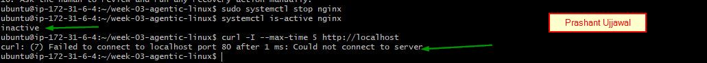

---

#### Screenshot 14 — `/linux-triage` output showing failed evidence, most likely cause, and a suggested recovery command

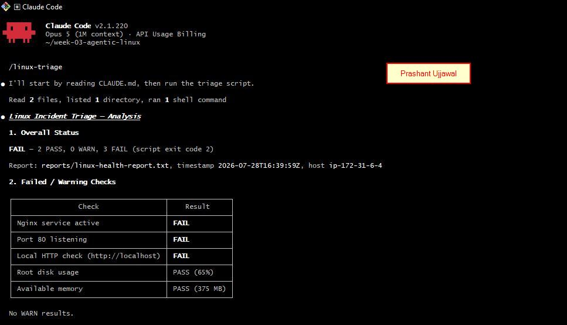
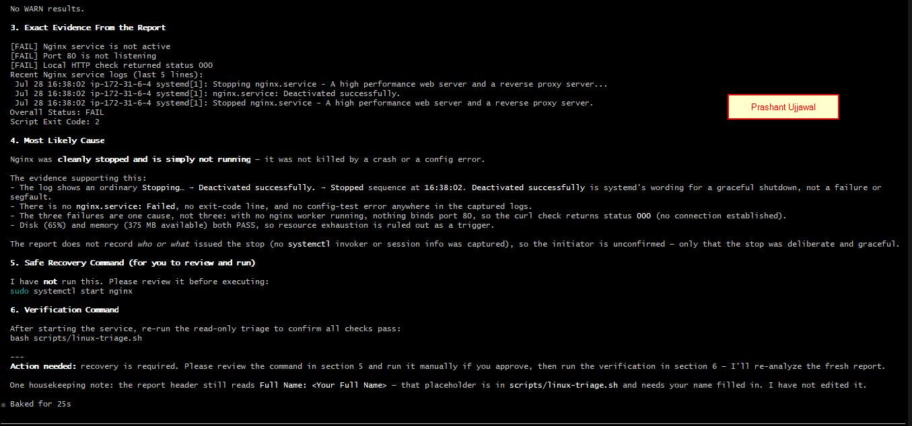

---

#### Screenshot 15 — `incident-failure-report.txt` showing the failed checks and your Full Name

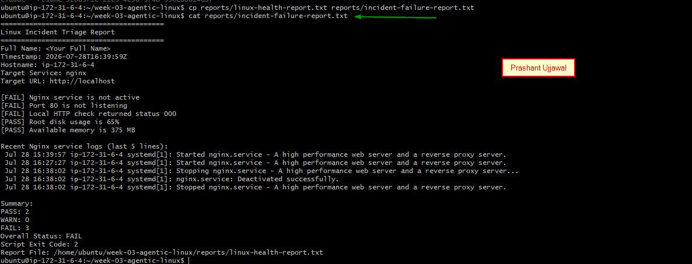

---

### Notes

Answer the following in your own words:

**1. Which three checks failed?**

The Nginx service check, port 80 listening check and local HTTP check failed.

---

**2. What evidence supports the conclusion that Nginx is unavailable?**

Nginx was inactive, port 80 was not listening and the local HTTP request failed to return 200 OK.

---

**3. Did Claude execute the recovery command? Why is that important?**

No, Claude only recommended the command. This keeps the recovery action under human review and control.

---

**4. Which phase of the Agentic Loop is represented by the Bash report?**

The Bash report represents the Gather phase because it collects the server’s health evidence.

---

**5. Which phase is represented by Claude's explanation?**

Claude’s explanation represents the Analyze phase because it interprets the collected evidence.

---

# Task 8 — Recover Manually, Verify Again, and Write the Incident Summary

## Goal

Recover the service as the human operator and prove that the system is healthy again.

### Evidence

#### Screenshot 16 — Output showing Nginx is active and `curl -I http://localhost` returns 200 OK

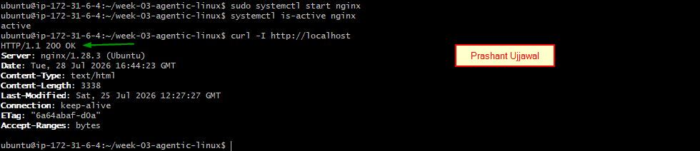

---

#### Screenshot 17 — Second `/linux-triage` output showing successful recovery with no FAIL results

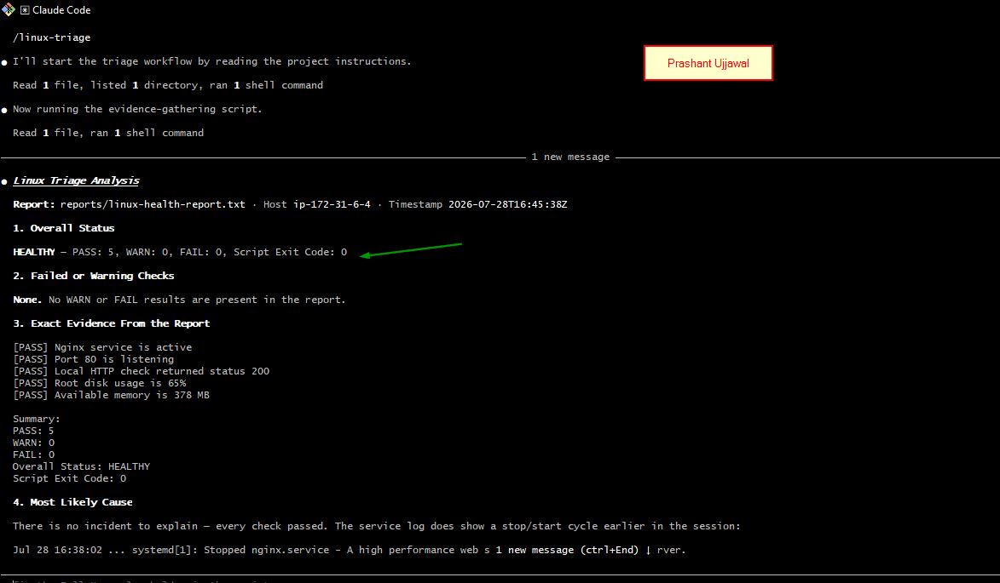

---

#### Screenshot 18 — Output of `ls -lah reports` showing both `incident-failure-report.txt` and `recovery-report.txt`

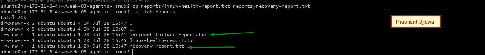

---

#### Screenshot 19 — `incident-summary.md` showing all required sections and your Full Name

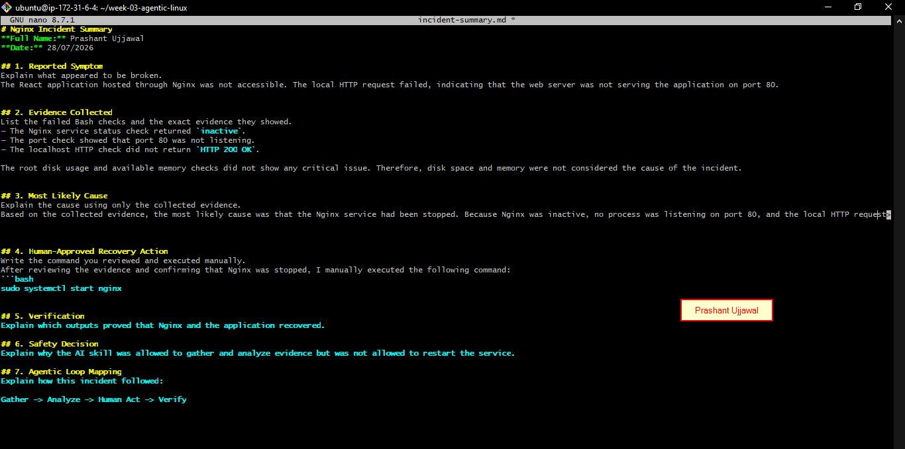

---

### Notes

Answer the following in your own words:

**1. What action did you execute manually?**

I manually ran sudo systemctl start nginx to start the Nginx service.

---

**2. What evidence proves that the service recovered?**

systemctl is-active nginx returned active, curl -I http://localhost returned 200 OK, and the second report showed no failed checks.

---

**3. Why is the second triage run necessary?**

The second run verifies that the recovery action worked and that the server returned to a healthy state.

---

**4. What could go wrong if an AI agent automatically restarted every failed service?**

It could restart the wrong service, hide the real cause or create additional downtime and instability.

---

**5. In one sentence, explain the difference between using AI as a chatbot and using AI in this agentic workflow.**

A chatbot gives general answers, while this agentic workflow analyzes real evidence and supports a controlled human decision.

---

# Incident Summary

Fill in all seven sections below in your own words.

**Full Name:** Add your full name here

**Date:** DD/MM/YYYY

---

**1. Reported Symptom**

Add your answer here.

---

**2. Evidence Collected**

Add your answer here.

---

**3. Most Likely Cause**

Add your answer here.

---

**4. Human-Approved Recovery Action**

Add your answer here.

---

**5. Verification**

Add your answer here.

---

**6. Safety Decision**

Add your answer here.

---

**7. Agentic Loop Mapping**

Add your answer here.

---

# LinkedIn Post (Required)

## Evidence

#### LinkedIn Post URL

Paste your LinkedIn post URL here:

https://www.linkedin.com/posts/prashant-ujjawal-cloud_dmibypravinmishra-learninginpublic-activity-7492238564144066560-nyBY?utm_source=share&utm_medium=member_desktop&rcm=ACoAAGOurAIBVJIrm5LJF5zHqff-suwZ6n1bB8k

---

#### Screenshot — Published LinkedIn post

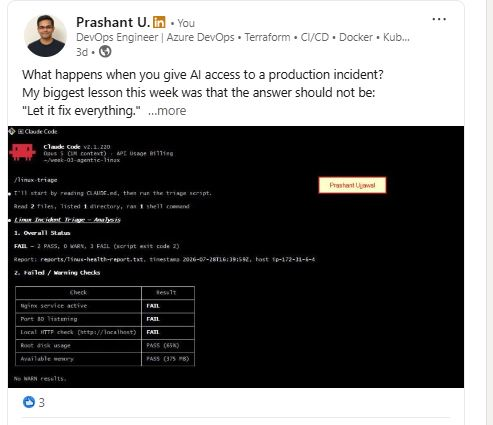

---

# GitHub Repository URL

Paste the URL of your GitHub folder or repository containing the assignment files here:

https://github.com/prashantujjawal-wq/devops-micro-internship-pravinmishra

---

# Submission Instructions

- Add all required screenshots in your submission
- Full Name must be visible in required screenshots and the Bash report
- All written answers must be in your own words
- Do not expose sensitive information (keys, passwords, AWS account IDs, tokens)
- GitHub URL must be included in this document

---

# Completion Checklist

- [x] Task 1: Healthy baseline confirmed, workspace created (Screenshots 1–2, Notes answered)
- [x] Task 2: CLAUDE.md created with all four sections (Screenshot 3, Notes answered)
- [x] Task 3: Five-check plan produced by Claude using read-only tools (Screenshot 4, Notes answered)
- [x] Task 4: `linux-triage.sh` created, syntax validated, executable permission set (Screenshots 5–8, Notes answered)
- [x] Task 5: Healthy-state report generated with no FAIL result (Screenshots 9–10, Notes answered)
- [x] Task 6: `/linux-triage` skill created and run successfully on healthy server (Screenshots 11–12, Notes answered)
- [x] Task 7: Nginx incident simulated, failed evidence captured, Claude did not execute recovery (Screenshots 13–15, Notes answered)
- [x] Task 8: Nginx recovered manually, recovery verified, reports saved, incident summary complete (Screenshots 16–19, Notes answered)
- [x] Incident summary contains all seven required sections
- [ ] LinkedIn post published and URL submitted
- [x] Full Name visible in all required screenshots and the Bash report
- [x] Skill does not have Write permission
- [x] Skill did not execute any recovery commands
- [x] No sensitive data exposed

---

## 📌 About DMI & CloudAdvisory

DevOps Micro Internship (DMI) is a project-based DevOps program run by Pravin Mishra (The CloudAdvisory) focused on real-world execution, systems thinking, and career readiness.

It helps learners build strong DevOps foundations with hands-on experience.

---

## 📌 Resources

- 🌐 DMI Official Website: https://dmi.pravinmishra.com?utm_source=github&utm_medium=readme  
- 🎓 University: https://university.pravinmishra.com?utm_source=github&utm_medium=readme  
- 💬 Discord Community: https://discord.pravinmishra.com?utm_source=github&utm_medium=readme  
- 📝 Blog: https://dmi.pravinmishra.com/blog?utm_source=github&utm_medium=readme  
- ▶️ YouTube Playlist: https://www.youtube.com/playlist?list=PLFeSNDtI4Cho  
- 🔗 Pravin Mishra (LinkedIn): https://www.linkedin.com/in/pravin-mishra-aws-trainer/  
- 🏢 CloudAdvisory (LinkedIn): https://www.linkedin.com/company/thecloudadvisory/

---

*This submission is part of DevOps Micro Internship (DMI) Cohort 3 — Agentic AI Track.*